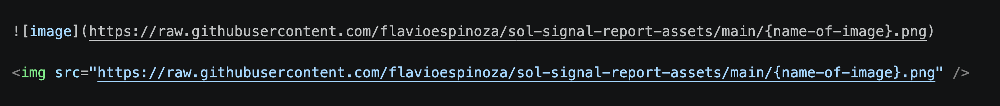

# sol-signal-report-assets

Public image assets for Sol Signal reports (charts, backtest tables)

## Use

## Example

In this markdown, the examples you see below are using the exact pattern you see above in the image, and the name of the image that is online is [logo-solana-icon.png](https://raw.githubusercontent.com/flavioespinoza/sol-signal-report-assets/main/logo-solana-icon.png) -- Click on a link to see the image. 

---

#### Markdown
 

---

#### HTML
